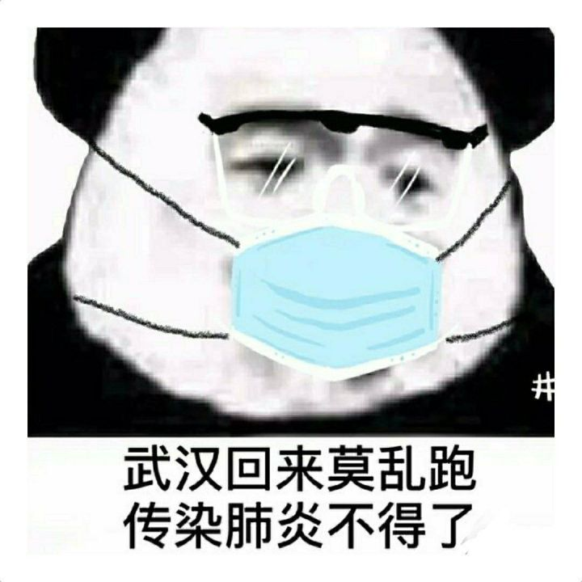
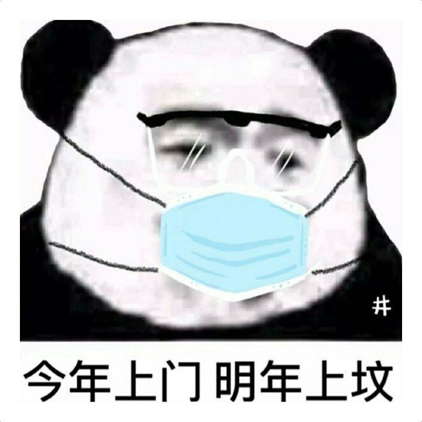
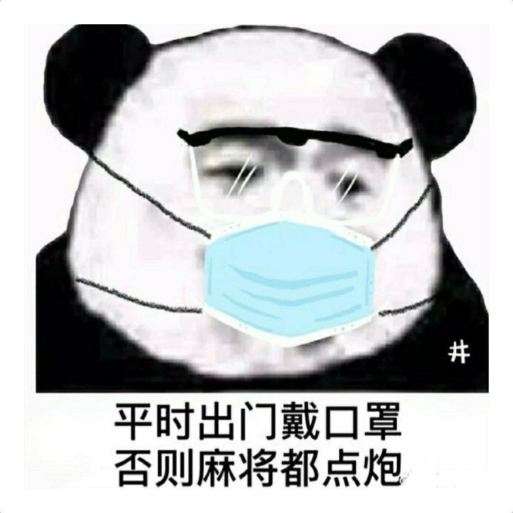
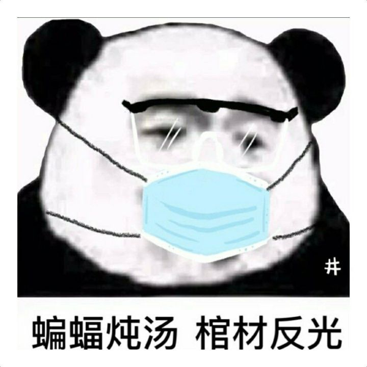
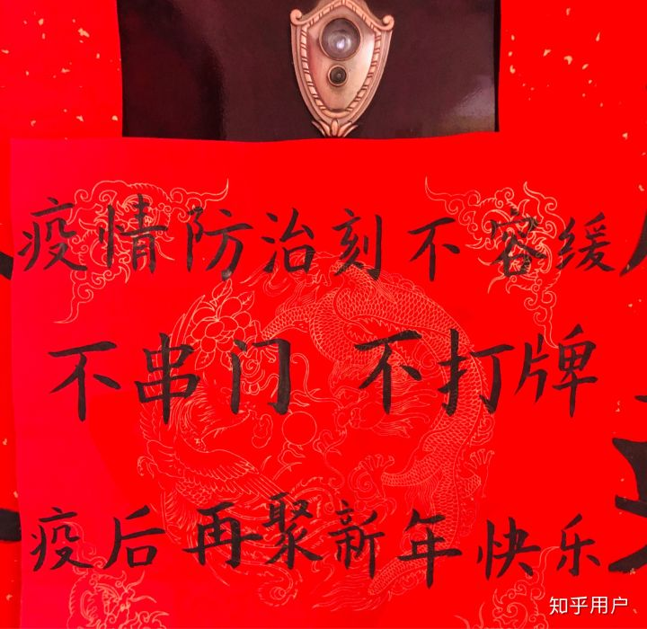
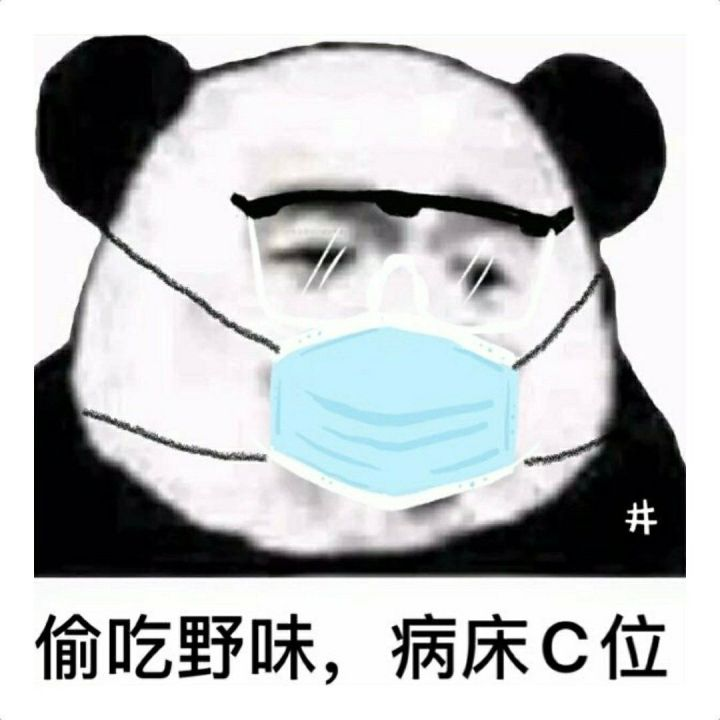
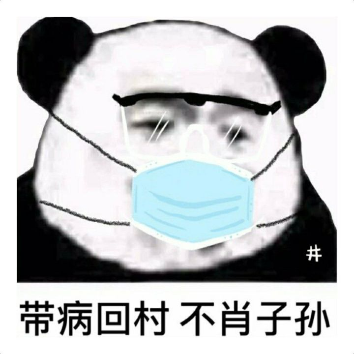
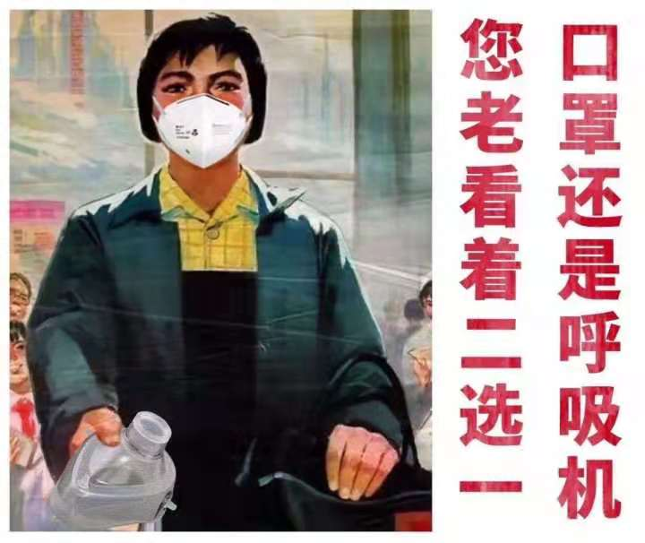
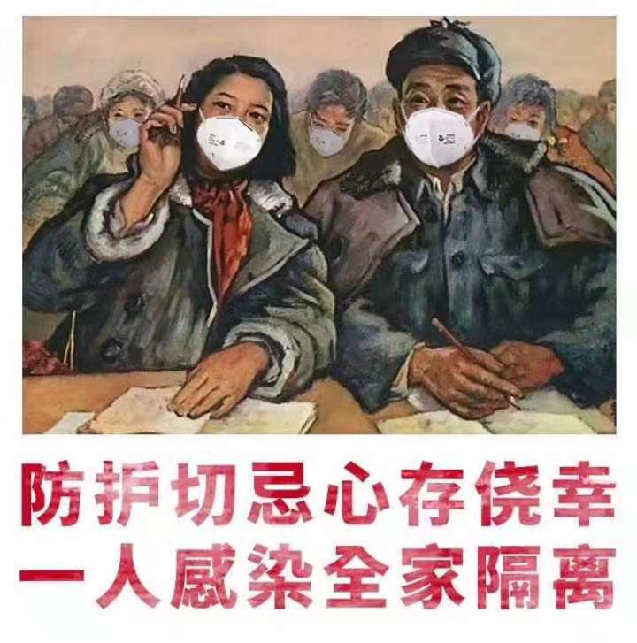
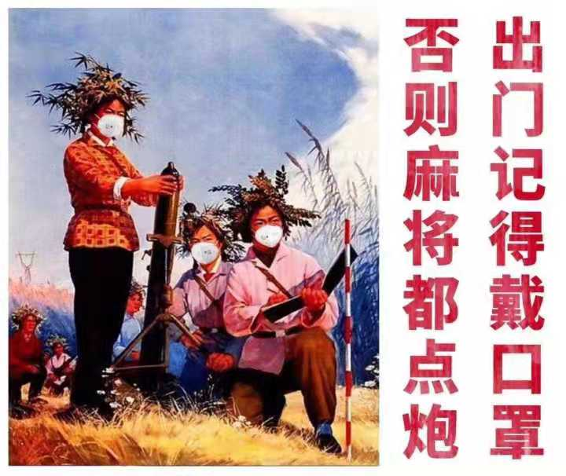

# 新型肺炎防疫
> 及时通报，有效防控，坚决打赢这场没有硝烟的战争。

- 病毒：新型冠状病毒2019-nCoV
- 传染源：新型冠状病毒感染的肺炎患者
- 传播途径：经呼吸道飞沫传播，亦可通过接触传播，存在粪-口传播可能性
- 易感人群：人群普遍易感。老年人及有基础疾病者感染后病情较重，儿童及婴幼儿也有发病
- 潜伏期：1~14天均有，平均10天，潜伏期内存在传染性
- 临床表现：以发热、乏力、干咳为主要表现。重型病例多在一周后出现呼吸困难。重型、危重型患者病程中可为中低热，甚至无明显发热
- 宿主：野生动物，可能为中华菊头蝠

<table>
<tr>
    <td></td>
    <td></td>
    <td></td>
</tr>
<tr>
    <td></td>
    <td></td>
    <td></td>
</tr>
<tr>
    <td></td>
    <td></td>
    <td></td>
</tr>
</table>

## 疫情动态
[查询新型肺炎患者同乘工具](https://2019ncov.nosugartech.com/search.html)

疫情地图、全国发热门诊、疫情最新进展：
- [丁香园新型肺炎疫情实时动态](https://3g.dxy.cn/newh5/view/pneumonia)
- [360新型肺炎疫情实时动态](https://arena.360.cn/docs/wuhan_pneumonia/)
- [网易新型肺炎疫情地图](https://news.163.com/special/epidemic/)
- [百度疫情通报](https://voice.baidu.com/act/newpneumonia/newpneumonia)
- [新浪疫情实时动态](https://news.sina.cn/zt_d/yiqing0121)
- [第一财经疫情地图](https://m.yicai.com/news/100476965.html)
- [腾讯新闻疫情实时追踪](https://news.qq.com/zt2020/page/feiyan.htm)
- [凤凰网疫情实时动态](https://news.ifeng.com/c/special/7tPlDSzDgVk)
- [梅斯疫情实时动态](https://m.medsci.cn/wh.asp)
- [腾讯微保疫情实时动态](https://api.wesure.cn/app/innovate/pneumonia/index.html)
- [阿里健康疫情实时动态](https://www.mdeer.com/influenzamap)
- [夸克浏览器疫情实时动态](https://broccoli.uc.cn/apps/pneumonia/routes/index)
- [疫情信息静态化](./special/README.md)

## 辟谣
[较真查证平台-腾讯新闻](https://vp.fact.qq.com/home)

[【凉风辟谣】开局一张图，内容全靠编！别再信谣传谣啦！](https://www.bilibili.com/video/av85542896)

[关于新冠肺炎的100条科学信息-人民网](https://zhuanlan.zhihu.com/p/104315451)

[面对武汉疫情，我更愿意相信让专业的人去做专业的事-毕导](https://mp.weixin.qq.com/s?src=11&timestamp=1580045701&ver=2120&signature=KsdV6RuFTSA6n8OlESk8gRJzH33wCP36LpUx7t9xb3VgAvvIkgTMMfLyQMQZwnE9SV2vSrNqEWCU4XY68bYkaQvFJNsGwsg7AuR43u7CQi3g9mGeUGgy5onIfoh-8F1D&new=1)

## 防控
#### 一、防护措施
[防护知识合辑-丁香医生](https://mp.weixin.qq.com/s/UkWbqzKRe2DITz2nS6-XvQ)

> 1、出门戴口罩（首选医用外科口罩、N95口罩），[勤洗手](https://mp.weixin.qq.com/s?__biz=MjA1ODMxMDQwMQ==&mid=2657273187&idx=5&sn=7abd6d8bff45341c85bd88575e034c9f&chksm=4906c10d7e71481b5c82ff09e384e0e3118e28bc59f036b290a481eb8b4b64f78822ff5fc3d8&scene=21#wechat_redirect)， 
2、避免近距离接触有流感症状的人，避免近距离接触野生动物， 
3、不随地吐痰，咳嗽或打喷嚏时用纸巾或肘关节掩住口鼻， 
4、待在家里，不去人多的地方，不去聚会。

视频教学：
- [【朱广权】这才是戴口罩洗手的正确姿势 比Rap更好看！](https://www.bilibili.com/video/av85385462)
- [正确戴外科口罩的十二个步骤](https://www.bilibili.com/video/av84429638)
- [戴上N95口罩的六个步骤](https://www.bilibili.com/video/av84422414)
- [医用防护服使用指南](https://www.bilibili.com/video/av84823516)

**谈谈口罩和防疫：**
- [原文链接1](https://mp.weixin.qq.com/s/1QmU8v9C23DXQ9Y4TQohZA)
- [原文链接2](https://mp.weixin.qq.com/s?src=11&timestamp=1580037005&ver=2120&signature=adSY285WoZhc1kqFx-T92zJUqBEuF3M7b03uxAWxnr6ConC4kq9fLAV0eaRfWFawE-R-OszwD4ULq8jiVWvWWf4BIaFIs*-nBE*4KYmp7K1shYK*1j-lGs*PdogDBQZ-&new=1)

口罩主要是防止吸进去别人的唾沫星子、鼻涕星子什么的。唾沫星子有大有小。小唾沫星子的很轻，可以在空气中悬浮很长时间。你呼吸的时候就可能吸进去。然后唾沫星子里的病毒就把你给感染了。

同样的口罩对不同大小的微粒过滤能力不一样。特别大的微粒比较容易过滤，这个好理解。比如别人拿枣扔你，你拿漏勺就能挡住。但特别小的微粒也很容易过滤。这是因为口罩有两种过滤机制：一种是机械过滤，就是类似拿漏勺挡枣；另一种机制是静电吸附，那么当然越小越轻的微粒就越容易被吸住。所以大的小的都容易，最难过滤的是0.3微米左右的颗粒。所以口罩的过滤效果一般用0.3微米的颗粒物来测试。常说的N95口罩，就是对0.3微米的颗粒物至少能挡住95%。

摸过公用物品要洗手，收过快递要洗手，总之碰过别人可能碰过的东西都要洗手。就算没碰过也要勤洗手。因为前面说了，唾沫星子有大有小，大个儿的也可能喷你手上。洗手很重要。我看过一些研究，基本上都认为对于预防呼吸道传染病来说，洗手甚至比戴口罩更重要。在外面不方便洗手可以揣一包酒精棉片，随时擦擦。那东西很便宜，几元钱一大包。

咳嗽打喷嚏的时候应该用肘关节内侧挡着嘴，而不是用手捂嘴。因为如果用手捂嘴的话，如果你体内有病毒，就被你喷手上了。然后你再到处一摸，就变成一个行走的病毒扩散器。

#### 二、如何劝说身边人引起对新型肺炎的重视？
- [如何劝说父母家人对新型冠状病毒引起必要的重视?-知乎](https://www.zhihu.com/question/367258958)
- [【不看后悔！】做这件事！积德积善！](https://mp.weixin.qq.com/s/e4ruQmt91sQ46BR65OH4og)
- [专家忠告！一个口罩或可拯救一家人！ 现在知道还不晚！（转给家人）](https://mp.weixin.qq.com/s/h-pAKaH35Hy0bz5wewDOCg)

<table>
    <tr>
        <td></td>
        <td></td>
        <td></td>
    </tr>
    <tr>
        <td></td>
        <td></td>
        <td></td>
    </tr>
    <tr>
        <td></td>
        <td></td>
        <td></td>
    </tr>
</table>

## 个体叙述
- [豆友的第一手叙述](https://www.douban.com/doulist/122759092/)
- [豆瓣豆列：瘟疫时期](https://www.douban.com/doulist/122857988/)
- [武汉UP主实拍：医院、医生、武汉人生活的情况](https://www.bilibili.com/video/av85319402)
- [武汉UP实拍，封城后的24小时](https://www.bilibili.com/video/av84850049)

## 视频
- [武汉城市宣传片：爱和希望比病毒蔓延的更快](https://weibo.com/tv/v/IsuW8hEro)
- [【新闻1+1】还有多久能研制出疫苗？2020-01-28](https://www.bilibili.com/video/av85487225?p=2)
- [钟南山：疫情或在7到10天达到高峰](https://www.bilibili.com/video/av85485703)
- [白岩松访钟南山：新型肺炎疫情如何防控](https://v.qq.com/x/cover/mzc00200oqqk983/v00336kuxnm.html)
- [【回形针PaperClip】关于新冠肺炎的一切](https://www.bilibili.com/video/av86216616)
- [“冠状病毒”是什么？武汉新型肺炎病毒是如何使人生病的？](https://www.bilibili.com/video/av85537015)
- [【鬼谷闲谈】病毒：生于三界之外 不灭六道之中](https://www.bilibili.com/video/av85751585)
- [计算机仿真程序告诉你为什么现在还没到出门的时候！！！2020-02-03](https://www.bilibili.com/video/av86478875)

## 相关新闻话题
- [副本 新冠肺炎：內地傳媒深度報道選編](https://shimo.im/docs/vj38GdGpqDJtGkKJ/read)
- [新型肺炎防疫全记录-财新网](http://m.app.caixin.com/m_topic_detail/1473.html)
- [新型冠状病毒-知乎话题](https://www.zhihu.com/topic/21238418/top-answers)
- [武汉红十事件](./red_cross.md)
- [双黄连能否抑制肺炎先不提，显然能抑制智商](https://www.huxiu.com/article/337582.html)
- [武汉大瘟疫，国字头专家们贡献了什么？](https://mp.weixin.qq.com/s?src=11&timestamp=1580437403&ver=2129&signature=KUF-QAegVDNWbFb8jtbqqeaL2FXJ6m0ribeNrcLCAULKw0FR7RhkV7SaTB42Aaap6yY7grZkbcBZmpWXVCcBwxsZa3dGbFGQFXfK7peqqm2rg4OvUSDFE6i7Au9KbyBE&new=1)
- [春节档电影集体撤档，《囧妈》在头条系平台免费播放](https://www.toutiao.com/a6785780582010847748)
- [武汉肺炎爆发后，300万中国父母拒绝戴口罩](https://k.sina.cn/article_1887344341_707e96d502000t0zs.html)

## GitHub相关项目
- [记录自2019年12月起武汉新冠肺炎疫情进展的时间线](https://github.com/Pratitya/wuhan2020-timeline)
- [武汉新型冠状病毒防疫信息收集平台](https://github.com/wuhan2020/wuhan2020)
- [为抗击新肺炎贡献一份技术力量-App研发](https://github.com/fluttercandies/ncov_2019)
- [2019新型冠状病毒疫情实时爬虫](https://github.com/BlankerL/DXY-2019-nCoV-Crawler)
- [2019新型冠状病毒疫情时间序列数据仓库](https://github.com/BlankerL/DXY-2019-nCoV-Data)

## 相关链接
- [【不沙雕动画】小蓝是一位医生——《逆行》](https://www.bilibili.com/video/av85339389)
- [口罩护目镜头像生成器](https://h5.codefuture.top/2020-mask)
- [我要戴口罩-微信小程序](https://github.com/idealclover/Wear-A-Mask)
- [非典-纪录片](https://www.bilibili.com/video/av8132069)
- [面对面抗击非典-央视新闻](https://v.qq.com/x/page/y0197dxwv57.html)
- [2003年非典时期敢说真话的钟南山](https://www.bilibili.com/video/av85065534)
- [《瘟疫公司》游戏](https://www.zhihu.com/topic/19837100/top-answers)
- [《流感》韩国电影](https://v.youku.com/v_show/id_XNzA0OTIwMzg4.html)
- [Internet-Archive-of-2019-nCoV](https://www.notion.so/Internet-Archive-of-2019-nCoV-49f563331d4145c1865f6cc8f0c05132)
- [北邮人整合的疫情相关网站](http://jiayou.beiyouren.cn/jiayou/)
