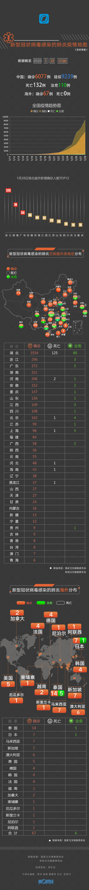

# 疫情信息离线版本

**2020-02-01 14:34:49**
> 越南确诊一例新型冠状病毒肺炎病例。改名感染者为女性，25岁，此前曾与早先确诊新冠肺炎的2名中国公民有过接触。

**2020-02-01 13:40:27**
> 2月1日0—12时，上海市新增确诊病例16例，累计发现确诊病例169例。

**2020-02-01 10:02:43**
> 截至2月1日6时，天津新增2例新型冠状病毒感染的肺炎确诊病例，确诊病例增至34例。

**2020-02-01 09:12:13**
> 广东31日当天全省新增确诊病例127例，累计确诊520例。

**2020-02-01 09:01:22**
> 1月31日0-24时，安徽省报告新增确诊病例60例，累计报告确诊病例297例。

**2020-02-01 08:53:22**
> 截至1月31日24时，江苏省累计报告新型冠状病毒感染的肺炎确诊病例202例。

**2020-02-01 08:43:22**
> 1月31日0-24时，河南省新增新型冠状病毒感染的肺炎确诊病例70例，累计确诊422例。

**2020-02-01 08:08:22**
> 1月31日0-24时，广西壮族自治区共新增新型冠状病毒感染的肺炎确诊病例13例，累计100例。

**2020-02-01 08:00:26**
> 1月31日0-24时，全国报告新增确诊病例2102例，新增死亡46例。累计确诊病例11791例，死亡259例，累计治愈出院 243例。

**2020-02-01 07:31:36**
> 1月31日12—24时，上海市新增确诊病例18例，累计发现确诊病例153例。

**2020-02-01 06:36:13**
> 1月31日0时-24时，湖北省新增新型肺炎病例1347例，死亡45例。

**2020-02-01 06:23:36**
> 美国宣布新型冠状病毒疫情构成美国公共健康紧急事件。同时还宣布，从美东时间2月2日下午5时开始，过去14天内曾到访中国的外国人将被暂时禁止入境。

**2020-02-01 04:51:30**
> 山西新增确诊病例8例。

**2020-02-01 00:23:36**
> 截至1月31日24时，甘肃新增6例新型冠状病毒感染的肺炎确诊病例。

**2020-01-31 23:38:32**
> 辽宁省新增12例新型冠状病毒感染的肺炎确诊病例。

**2020-01-31 16:14:00**
> 截至1月31日12时，北京市累计确诊病例139例，其中死亡1例，出院5例。

**2020-01-31 15:20:00**
> 截至1月31日12时，云南省全省累计报告新型冠状病毒感染肺炎确诊病例83例。

**2020-01-31 14:15:13**
> 据韩媒报道，韩国新增4例新冠肺炎确诊病例。截至目前，韩国累计确诊病例已达11例。

**2020-01-31 12:43:57**
> 截至1月31日10时30分，辽宁省累计报告新型冠状病毒感染的肺炎确诊病例48例，其中重型病例8例，大连市治愈出院1例。

**2020-01-31 12:32:17**
> 截至1月30日24时，北京新增11例新型肺炎病例，累计确诊病例132例，从发病到就诊最长的隔十天。

**2020-01-31 10:06:24**
> 截至1月31日6时，天津市新增1例新型冠状病毒感染的肺炎确诊病例，确诊病例增至32例。

**2020-01-31 09:43:33**
> 1月30日0-24时，湖南省报告新型冠状病毒感染的肺炎新增确诊病例55例，累计确诊332例，治愈2例。

**2020-01-31 09:00:16**
> 1月30日0-24时，浙江省报告新型冠状病毒感染的肺炎新增确诊病例109例，累计确诊病例537例。

**2020-01-31 08:48:20**
> 据韩联社31日消息，韩国又新增1例新型冠状病毒感染的肺炎确诊病例，至此，韩国新型冠状病毒感染的肺炎累计确诊病例已达7例。

**2020-01-31 08:06:34**
> 1月30日0-24时，全国累计确诊新冠肺炎9692例死亡213例，昨日新增确诊1982例。

**2020-01-31 07:48:59**
> 截至1月30日24时，上海市已累计发现确诊病例128例。

**2020-01-31 07:20:59**
> 1月30日24时，山西省9个市累计报告新型冠状病毒感染的肺炎确诊病例39例。

**2020-01-31 07:06:59**
> 1月30日24时，重庆市累计报告新型冠状病毒感染的肺炎确诊病例206例。

**2020-01-31 06:34:12**
> 湖北新增病例1220例，新增死亡42例，新增出院26例；累计确诊病例5806例，已治愈出院116例，死亡204例。

**2020-01-31 04:04:14**
> 世卫组织宣布新型冠状病毒疫情为国际关注的突发公共卫生事件，强调不建议实施旅行和贸易限制。

**2020-01-31 02:38:14**
> 美国疾病控制与预防中心确认，伊利诺伊州新出现一例新型冠状病毒感染病例，为美国首例人传人感染。

**2020-01-30 21:40:00**
> 湖北省委书记：今天前12小时湖北新增确诊病例317人。

**2020-01-30 18:45:00**
> 截至1月30日18时，青海累计报告新型冠状病毒感染的肺炎确诊病例8例，均为武汉输入性病例。

**2020-01-30 18:30:00**
> 截至1月30日14时,天津新增1例新型冠状病毒感染的肺炎确诊病例，确诊病例增至30例。

**2020-01-30 17:40:00**
> 台湾新增确诊病例1例。

**2020-01-30 17:20:00**
> 印度新增确诊新型肺炎1例，韩国新增2例。

**2020-01-30 16:20:00**
> 截至1月30日12时，广东全省累计报告新型冠状病毒感染的肺炎确诊病例354例。

**2020-01-30 16:00:00**
> 截至1月30日12时，重庆市累计报告新型冠状病毒感染的肺炎确诊病例182例，出院病例1例。

**2020-01-30 15:01:16**
> 截至1月30日12时，山东省累计报告新型冠状病毒感染的肺炎确诊病例158例，出院病例1例。

**2020-01-30 13:40:16**
> 截至1月30日12时，上海新增11例新型冠状病毒感染的肺炎确诊病例，累计发现确诊病例112例。

**2020-01-30 12:50:00**
> 30日，马来西亚卫生部宣布新增1例新型冠状病毒感染的肺炎确诊病例，累计确诊病例8例，均是中国籍。

**2020-01-30 12:27:59**
> 加拿大确认第3例新型冠状病毒感染者，其中2例在多伦多，是一对夫妇，1例在温哥华，这3人全部为来自中国武汉的输入性病例。

**2020-01-30 10:47:30**
> 1月29日20时至30日8时，北京市新增3例新型冠状病毒感染的肺炎病例。

**2020-01-30 10:38:30**
> 截至1月30日6时天津市新增1例新型冠状病毒感染的肺炎确诊病例，确诊病例增至28例。

**2020-01-30 09:29:48**
> 日本包机从武汉撤侨，首批返日人员确诊3例新冠肺炎病例。截至目前，日本国内已确诊11例新型冠状病毒感染的肺炎病例。

**2020-01-30 09:08:23**
> 截至1月29日24时，浙江省新增病例132例，累计确诊病例428例，重症病例54例，出院病例4例。

**2020-01-30 08:42:24**
> 截至1月29日24时，河南全省新增72例确诊，累计确诊病例278例，新增死亡1例。

**2020-01-30 08:37:49**
> 1月29日0-24时,安徽省新型冠状病毒感染的肺炎新增确诊病例48例，累计确诊病例200例。

**2020-01-30 08:24:09**
> 1月29日0—24时，河北省报告新型冠状病毒感染的肺炎新增确诊病例17例，累计65例。

**2020-01-30 08:07:41**
> 1月29日12—24时，上海市新增新型冠状病毒感染的肺炎确诊病例5例，累计确诊病例101例，其中，男性54例，女性47例；年龄最大88岁，最小7岁。

**2020-01-30 07:52:44**
> 1月29日0—24时，全国新增确诊病例1737例，新增死亡病例38例，西藏首例确诊病例。

**2020-01-30 07:28:43**
> 法国确诊第五例病例，病患为28日确诊的男性中国游客的女儿，目前已在巴黎7大毕夏医院住院治疗。

**2020-01-30 06:27:08**
> 湖北新增确诊病例1032例，新增死亡37例；截至29日24时，累计报告确诊病例4586例，已治愈出院90例，死亡162例。

**2020-01-30 03:54:39**
> 江西新增53例累计确诊162例；山西新增8例累计确诊35例。

**2020-01-30 03:15:10**
> 芬兰确诊首例新型冠状病毒感染病例，系中国游客。

**2020-01-29 21:00:00**
> 四川新增新型肺炎死亡1例，另有解除隔离1例，治愈出院1例。

**2020-01-29 20:20:00**
> 西藏启动重大突发公共卫生事件Ⅰ级响应，至此，全国31个省市区已启动重大突发公共卫生事件Ⅰ级响应。

**2020-01-29 20:00:00**
> 中国疾控中心流行病学首席科学家曾光表示：疾病有潜伏期，大概到正月十五，应该能看到明显的成效。

**2020-01-29 11:20:00**
> 1月29日上午11时许，4名新型冠状病毒感染的肺炎患者经过治疗，从武汉市金银潭医院出院。

**2020-01-29 08:50:05**
> 浙江省新型冠状病毒感染的肺炎新增确诊病例123例，累计确诊病例296例。

**2020-01-29 08:18:40**
> 西藏首次报告新冠肺炎疑似病例1例。

**2020-01-29 06:33:28**
> 湖北新增新型冠状病毒感染的肺炎病例840例，新增死亡25例；截至1月28日24时，湖北累计报告病例3554例，死亡125例。

**2020-01-29 04:40:29**
> 山西新增确诊病例7例；江西新增确诊病例37例；黑龙江新增确诊病例1例。

**2020-01-28 20:45:00**
> 美国专家认为，鉴于新型病毒肺炎发病存在潜伏期，那首例人类感染应当发生在11月，甚至更早。

**2020-01-28 20:40:00**
> 台湾新增首例家庭聚集性病例，目前累计确诊8例。患者为一名50多岁的男性，是先前第5例患者的同住家人。

**2020-01-28 19:00:00**
> 钟南山表示，10到14天是一个很好的隔离观察期，发病的及时治疗，没发病也就没病，不会因为春运返程出现大传染。

**2020-01-28 18:19:00**
> 近日，长江财险董事长、原黄石市市长杨晓波因重症肺炎去世，享年57岁。

**2020-01-28 17:00:00**
> 香港特区行政长官林郑月娥宣布，内地暂停发出来港个人游签注；高铁香港段、城际直通车暂停，内地到港航班减半。

**2020-01-28 15:50:00**
> 北京市新增11例新型冠状病毒感染的肺炎病例，其中5例有湖北接触史，7例为此前确诊病例的密切接触者。

**2020-01-28 15:25:00**
> 山东全省新增确诊病例8例。

**2020-01-28 15:16:00**
> 内蒙古新增2例新型冠状病毒肺炎确诊病例。

**2020-01-28 15:15:04**
> 陕西新增11例新型冠状病毒感染的肺炎确诊病例。

**2020-01-28 12:10:42**
> 美国总统特朗普称，美方愿向中国提供任何必要的帮助，美国的专家将发挥其作用。

**2020-01-28 11:55:35**
> 1月28日，国家卫健委新型肺炎病例通报出院标准：临床症状缓解，体温正常，两次核酸检测都呈阴性才能确保出院没有传染性。

**2020-01-28 11:48:49**
> 世界卫生组织在1月26日及27日的新型冠状病毒报告中，将新型冠状病毒疫情全球范围风险改为高风险。

**2020-01-28 11:28:28**
> 国家医疗专家表示，一些无症状感染者也有一定传染率。

**2020-01-28 11:01:17**
> 湖北河南山东多名基层干部因“疫情防控不力”，被免职或处分。

**2020-01-28 10:57:39**
> 1月27日，医政医管局发布第四版肺炎诊疗方案，其中写明：经呼吸道飞沫传播是新型肺炎主要的传播途径，亦可通过接触传播。

**2020-01-28 10:46:20**
> 1月28日，原天合光能副总裁、中国商用价值群执行总裁杨军，成为北京首例因新冠病毒致死案例，年仅50岁。

**2020-01-28 10:00:01**
> 截至1月27日24时，湖南省报告新型冠状病毒感染的肺炎新增确诊病例43例，累计确诊病例143例。

**2020-01-28 09:32:10**
> 江苏省报告新型冠状病毒感染的肺炎新增确诊病例23例，累计确诊病例70例，出院病例1例。

**2020-01-28 09:05:47**
> 湖北省新增新型冠状病毒感染的肺炎病例1291例，死亡24例。全省累计确诊肺炎病例2714例，治愈出院47例，死亡100例。

**2020-01-28 08:49:17**
> 江苏省报告新型冠状病毒感染的肺炎新增确诊病例23例，累计确诊病例70例。

**2020-01-28 08:48:38**
> 截至1月27日24时，山东省累计报告新型冠状病毒感染的肺炎确诊病例87例。

**2020-01-28 08:25:26**
> 河南省新增确诊病例40例 累计168例。

**2020-01-28 08:21:02**
> 广西新增确诊病例5例，累计51例。

**2020-01-28 08:17:35**
> 截至1月27日24时，上海市新增新型冠状病毒感染的肺炎确诊病例13例。上海市累计发现确诊病例66例。

**2020-01-28 03:10:53**
> 江西新增新型冠状病毒肺炎确诊病例24例，累计确诊72例，出院2例。

**2020-01-28 00:20:53**
> 加拿大确诊第二例新型冠状病毒感染肺炎病例，为首名患者妻子。

**2020-01-28 00:03:53**
> 天津新型冠状病毒感染的肺炎确诊病例增至23例。

**2020-01-27 23:30:39**
> 深圳“新型肺炎”患者痊愈增至4人，其中三位痊愈者是一家人。

**2020-01-27 23:20:21**
> 北京新增8例新型冠状病毒感染的肺炎病例，累计确诊病例80例，出现首例死亡患者。

**2020-01-27 20:42:17**
> 柬埔寨确诊首例新型冠状病毒感染的肺炎病例。

**2020-01-27 19:02:24**
> 广东新增5例病例

**2020-01-27 18:34:23**
> 云南确诊病例增至26例

**2020-01-27 15:10:43**
> 北京新增4例确诊病例

**2020-01-27 13:01:03**
> 海南省出现首例新冠肺炎死亡病例，系80岁来自武汉女子，基础疾病为脑梗，并瘫痪在床。

**2020-01-27 12:36:18**
> 江西首例治愈新型冠状病毒感染肺炎患者出院。医生表示，该患者此前已为病危状态，按照国家诊疗指南进行治疗后，已于22日停止发烧。

**2020-01-27 11:54:04**
> 山东首例确诊新型冠状病毒肺炎病例已临床治愈。

**2020-01-27 11:16:54**
> 1月27日农历正月初三，受习近平委托，李克强来到武汉，考察指导疫情防控工作，看望慰问患者和奋战在一线的医护人员。

**2020-01-27 11:02:50**
> 1月27日0时至9时，辽宁省沈阳市新增1例输入性新型冠状病毒感染的肺炎确诊病例，该病例属重症病例。

**2020-01-27 10:43:40**
> 韩联社消息，韩国确诊第四例新型冠状病毒肺炎病例。

**2020-01-27 09:06:09**
> 截至1月26日24时，湖南省累计报告新型冠状病毒感染的肺炎确诊病例100例，重症病例22例，死亡病例0例，出院病例0例。

**2020-01-27 08:30:15**
> 2020年1月26日0-24时，河南省累计报告新型冠状病毒感染的肺炎确诊病例128例，重症病例17例，死亡1例。

**2020-01-27 08:15:27**
> 截至1月26日24时，上海市累计发现确诊病例53例，其中，男性29例，女性24例；年龄最大88岁，最小7岁。

**2020-01-27 07:56:07**
> 1月26日0-24时，全国报告新增确诊病例769例，新增死亡24例。累计确诊病例2744例，死亡80例。

**2020-01-27 01:25:55**
> 辽宁新增1例新型肺炎确诊病例，累计22例。

**2020-01-27 01:10:55**
> 河北省委、省政府下发公告，要求部分公务人员提前结束春节假期返回工作岗位。

**2020-01-27 01:07:55**
> 江西新增新型肺炎确诊病例12例，累计48例确诊病例。

**2020-01-27 00:35:55**
> 继暂停省际班车客运后，山东宣布暂停市际班车客运。

**2020-01-27 00:30:55**
> 陕西宣布推迟全省中小学幼儿园春季学期开学时间，天津宣布全市大中小学、幼儿园2020年春季延期开学。

**2020-01-26 22:46:11**
> 北京新增5例新型冠状病毒感染的肺炎病例。

**2020-01-26 21:46:27**
> 黑龙江佳木斯新增1例新型肺炎确诊病例

**2020-01-26 21:06:55**
> 云南新增5例确诊病例

**2020-01-26 20:18:56**
> 台湾确诊第四例新型冠状病毒感染的肺炎病例。

**2020-01-26 19:48:35**
> 天津确诊病例增至14例

**2020-01-26 19:39:44**
> 北京新增9例新型肺炎病例

**2020-01-26 19:28:43**
> 福建报告新增输入性新型冠状病毒感染的肺炎确诊病例6例。

**2020-01-26 18:01:16**
> 江苏镇江市确认2例新型冠状病毒感染的肺炎确诊病例

**2020-01-26 17:39:44**
> 截至26日12时，广西新增确诊3例，累计报告36例

**2020-01-26 16:59:26**
> 香港新增1例新型冠状病毒肺炎确诊病例，目前已感染6人

**2020-01-26 16:40:35**
> 辽宁省新增2例新型肺炎，辽宁累计确诊病例已达21例

**2020-01-26 16:00:18**
> 湖北襄阳市新增确诊病例7例

**2020-01-26 12:19:49**
> 葡萄牙发现首例疑似新型冠状病毒肺炎病例

**2020-01-26 11:15:49**
> 26日，中国疾控中心病毒所所长表示，该中心开始启动新型冠状病毒的疫苗研发，目前已经成功分离病毒，正在筛选种子毒株。

**2020-01-26 10:46:43**
> 澳门新增3例新型冠状病毒肺炎病例，累计5例。

**2020-01-26 09:31:31**
> 韩国媒体26日报道，韩国出现第三例新型冠状病毒感染的肺炎病例。

**2020-01-26 09:04:35**
> 1月25日0-24时，全国报告新增确诊病例688例，新增死亡患者15例。累计确诊病例1975例，死亡56例。

**2020-01-26 08:57:25**
> 湖南省新增确诊病例26例，累计69例。

**2020-01-26 08:25:35**
> 截至1月25日24时，山东省累计报告新型冠状病毒感染的肺炎确诊病例39例。

**2020-01-26 08:22:35**
> 河南新增51例新型冠状病毒肺炎确诊病例，累计确诊83例

**2020-01-26 07:59:07**
> 1月25日0—24时，上海市新增新型冠状病毒感染的肺炎确诊病例7例，死亡1例。死亡病例为88岁男性，合并有严重心肺肾等多脏器功能不全。

**2020-01-26 07:52:21**
> 加拿大确诊首例新冠肺炎病例。一名从武汉返回加拿大的居民被确诊感染新型冠状病毒，病情稳定，并已入院治疗。

**2020-01-26 07:01:03**
> 1月25日0-24时，湖北省报告新冠肺炎新增确诊病例323例，新增死亡病例13例。湖北省累计新冠肺炎确诊病例1052例，死亡病例52例,。

**2020-01-26 06:05:39**
> 山西省报告新型冠状病毒感染的肺炎新增确诊病例3例，累计报告新型冠状病毒感染的肺炎确诊病例9例。新增确诊病例中，晋中市2例、阳泉市1例。

**2020-01-26 03:30:09**
> 北京市卫建委发布声明称抗艾滋病药物可试用于新型肺炎治疗。

**2020-01-26 03:06:09**
> 北京证实3名医生感染新型冠状病毒，2人曾赴武汉出差，另一人曾与出差患病医生相邻而坐。

**2020-01-26 02:45:09**
> 北京新增10例新型肺炎感染者，累计确诊病例51例。

**2020-01-26 02:33:09**
> 江西新增18例新型肺炎确诊病例，累计确诊36例。

**2020-01-26 01:30:09**
> 海关总署发布声明称，将重启出入境人员填写健康申明卡制度。

**2020-01-26 01:12:25**
> 南宁报告1例确诊病例，25日全天广西新增确诊病例10例，累计33例新型冠状病毒感染的肺炎病例确诊病例。

**2020-01-26 00:41:07**
> 武汉市公安局交通管理局发布《关于对武汉市新型肺炎防控指挥部第9号通告的解答》。

**2020-01-26 00:31:22**
> 马来西亚新增1名新型肺炎确诊病例，累计人数已4人。

**2020-01-26 00:19:14**
> 辽宁新增1例新型肺炎确诊病例，累计确诊17例。

**2020-01-25 23:40:41**
> 湖北黄石正式确诊新型肺炎病例31例，死亡1例。

**2020-01-25 23:30:00**
> 天津市下发通知，要求公务人员提前结束假期，27日零时前返回岗位。

**2020-01-25 21:30:40**
> 即日起全国旅行社团队游全部暂停。

**2020-01-25 21:11:40**
> 香港将新型冠状病毒感染疫情应变级别提升至最高级。

**2020-01-25 21:01:40**
> 内蒙古启动重大公共卫生突发事件一级响应。

**2020-01-25 20:15:40**
> 美国将安排包机从武汉撤离公民和外交官。

**2020-01-25 20:00:40**
> 党中央成立应对疫情工作领导小组。

**2020-01-25 19:34:40**
> 截至1月25日17：00，海南省累计报告新型冠状病毒感染的肺炎确诊病例19例。

**2020-01-25 18:58:40**
> 25日，云南省报告输入性新型冠状病毒感染的肺炎新增确诊病例6例。

**2020-01-25 18:50:05**
> 截至25日17时，北京市新增5例新型冠状病毒感染的肺炎病例，累计确诊病例41例。

**2020-01-25 18:27:05**
> 吉林省启动突发公共卫生事件Ⅰ级应急响应。

**2020-01-25 18:20:04**
> 青海启动重大突发公共卫生事件Ⅰ级响应。

**2020-01-25 18:09:05**
> 陕西启动突发公共卫生事件Ⅰ级应急响应。

**2020-01-25 17:50:24**
> 青海确认首例新型肺炎确诊病例。

**2020-01-25 17:10:48**
> 林郑月娥：无限期暂停来往武汉的航班和高铁。

**2020-01-25 16:20:13**
> 武汉市新型肺炎防控指挥部发布通告：自2020年1月26日0时始，中心城区区域实行机动车禁行管理。

**2020-01-25 16:05:04**
> 澳大利亚悉尼所在的新南威尔士州今天确诊三例新型冠状病毒感染病例。

**2020-01-25 15:08:04**
> 日本确诊第三例新型肺炎，患者系武汉赴日游客。

**2020-01-25 15:07:48**
> 辽宁省新型冠状病毒感染的肺炎疫情联防联控工作领导小组1月25日决定，立即启动辽宁省重大突发公共卫生事件Ⅰ级响应。

**2020-01-25 14:45:48**
> 甘肃省委省政府决定：自1月25日14时起，启动重大突发公共卫生事件一级响应。 ​​​​

**2020-01-25 13:09:47**
> 国家卫生健康委派6支共1230人医疗救治队驰援武汉。上海、广东、军队3支医疗队已到达武汉投入工作。

**2020-01-25 12:15:56**
> 黑龙江省启动突发公共卫生事件一级响应机制。

**2020-01-25 11:48:47**
> 河南省长宣布河南防控新型肺炎启动一级应急响应

**2020-01-25 11:37:17**
> 结合当前疫情防控形势，新疆维吾尔自治区人民政府决定，自即日起，启动自治区重大突发公共卫生事件一级响应。

**2020-01-25 10:38:29**
> 1月25日，海南省政府决定启动突发公共卫生事件 Ⅰ 级应急响应。

**2020-01-25 09:43:48**
> 澳大利亚确诊首例新型冠状病毒肺炎病例。报道称，患者系中国公民，目前在墨尔本接受治疗，病情稳定。

**2020-01-25 09:06:45**
> 1月24日0-24时，河南新增确诊新型肺炎病例23例。累计病例32例。

**2020-01-25 08:32:05**
> 法国确诊第3例新型冠状病毒病例

**2020-01-25 08:21:12**
> 1月24日0-24时，全国新增确诊病例444例，新增死亡患者16例。累计确诊病例1287例，死亡41例。

**2020-01-25 07:29:35**
> 泰国确诊第5例新冠肺炎：33岁武汉女性 3天前赴泰度假

**2020-01-25 04:10:25**
> 德媒：德国发现3例新型冠状病毒疑似病例。

**2020-01-25 03:50:25**
> 法国确认两例新型冠状病毒肺炎病例。

**2020-01-25 01:58:25**
> 甘肃累计确诊4例新型冠状病毒感染的肺炎病例。

**2020-01-25 01:17:33**
> 江西新增11例新型冠状病毒肺炎确诊病例，累计报告18例。

**2020-01-25 01:16:20**
> 广西新型肺炎新增确诊病例10例，累计23例。

**2020-01-25 00:37:25**
> 香港新型冠状病毒感染肺炎确诊病例新增3例，累计达5例。

**2020-01-25 00:18:25**
> 江苏省启动突发公共卫生事件一级响应。

**2020-01-25 00:15:56**
> 尼泊尔确认首个新型冠状病毒感染病例。

**2020-01-24 23:39:32**
> 美国确诊第二例新型冠状病毒肺炎。

**2020-01-24 23:20:54**
> 广西自治区、山东省、福建省相继启动重大突发公共卫生事件一级响应机制。

**2020-01-24 21:12:07**
> 北京新增2例新型肺炎病例，累计病例36人。

**2020-01-24 20:07:07**
> 台湾确诊2例新型肺炎病例，呼吁大陆团尽快离境。

**2020-01-24 20:01:31**
> 浙江首例确诊新型肺炎患者痊愈出院。

**2020-01-24 19:25:14**
> 云南省、贵州省相继启动突发公共卫生事件一级响应。

**2020-01-24 19:08:12**
> 北京新增5例新型冠状病毒感染的肺炎病例，累计确诊34例。

**2020-01-24 18:35:25**
> 中国疾控中心成功分离我国首株新型冠状病毒毒种。

**2020-01-24 18:30:42**
> 军委后勤保障部已组织驻武汉地区部队医院派出40名医护人员，在武汉肺科医院重症监护室展开救治工作。

**2020-01-24 18:00:24**
> 辽宁省决定启动重大突发公共卫生事件Ⅱ级响应。

**2020-01-24 17:40:00**
> 新型肺炎已治愈出院38人，年龄最小的10岁。

**2020-01-24 17:37:13**
> 青海省发现首例新型冠状病毒感染的肺炎疑似病例。

**2020-01-24 16:19:36**
> 上海重庆安徽启动重大突发公共卫生事件一级响应。

**2020-01-24 14:48:19**
> 北京卫健委：截至1月24日14时，全市累计确诊病例29例。北京市已经启动重大突发公共卫生事件一级响应。

**2020-01-24 13:33:20**
> 国家病原微生物资源库公布首株新型冠状病毒毒种信息

**2020-01-24 13:16:01**
> 天津市启动应对新型冠状病毒感染的肺炎一级响应；安徽省决定启动重大公共卫生事件一级响应。

**2020-01-24 13:06:09**
> 国务院：对涉及缓报、瞒报、漏报疫情，落实防控措施不力，导致疫情扩散等严重后果的，将严肃处理。

**2020-01-24 13:00:09**
> 1月24日，湖北省新冠肺炎疫情防控指挥部决定，启动湖北省重大突发公共卫生事件Ⅰ级响应。

**2020-01-24 12:26:35**
> 山东今日新增确诊病例6例，累计15例。

**2020-01-24 12:17:19**
> 天津新增1例新型肺炎病例，无武汉旅行工作史

**2020-01-24 11:02:21**
> 湖南新增新型肺炎确诊病例15例 累计24例

**2020-01-24 10:57:11**
> 海南新增4例新型肺炎确诊病例 累计8例

**2020-01-24 10:31:11**
> 江苏新增新型肺炎确诊病例4例 累计9例

**2020-01-24 09:40:42**
> 韩国发现第2例新型冠状病毒感染肺炎确诊病例。

**2020-01-24 09:39:19**
> 重庆新增18例新型肺炎确诊病例 累计确诊27例

**2020-01-24 09:14:42**
> 湖北新增新冠肺炎病例105例 累计549例 新增死亡7例

**2020-01-24 08:59:42**
> 黑龙江新增2例新型肺炎确诊病例 死亡病例1例

**2020-01-24 08:51:42**
> 广东新冠肺炎新增确诊病例21例 累计确诊53例

**2020-01-24 08:22:08**
> 截至1月23日24时，国家卫健委收到29个省份累计报告新型肺炎确诊病例830例，死亡25例。

**2020-01-24 07:26:38**
> 日本发现第二例新型冠状病毒肺炎确诊病例，是一名从武汉来旅行的男子。

**2020-01-24 03:04:04**
> 北京新增4例新型肺炎确诊病例；天津新增1例新型肺炎确诊病例。

**2020-01-24 01:30:59**
> 广西新增新冠肺炎确诊病例8例，累计13例。

**2020-01-24 01:11:27**
> 英国出现4例新型肺炎病例。

**2020-01-24 00:16:42**
> 河北确诊第2例新型冠状病毒感染的肺炎病例，1月22日抢救无效死亡。

**2020-01-24 00:05:39**
> 江西新增4例新型冠状病毒肺炎。

**2020-01-23 23:58:35**
> 昆明确认第二例输入性新型肺炎病例。

**2020-01-23 22:31:00**
> 甘肃省确认2例新型冠状病毒感染的肺炎确诊病例。

**2020-01-23 22:30:00**
> 越南卫生部称，两名中国人在越南被确诊感染新型冠状病毒。越南媒体称，这两名中国人来自武汉市，是一对父子。 ​​​​

**2020-01-23 21:20:00**
> 江苏省报告新型肺炎新增确诊病例 4例。其中，南京市2例、连云港市和扬州市各1例，均有近期武汉旅行史。

**2020-01-23 21:10:00**
> 新加坡卫生部23号晚上确认，新加坡确认首例新型冠状病毒病例。患者是一位66岁男子。

**2020-01-23 18:00:00**
> 经陕西省省级医疗救治专家组会商，确认3例输入性新型冠状病毒感染的肺炎确诊病例。

**2020-01-23 18:00:00**
> 1月23日，新疆维吾尔自治区卫生健康委首次确认我区2例新型冠状病毒感染的肺炎确诊病例。

**2020-01-23 17:50:00**
> 北京市卫健委消息，截至今日14时本市新增8例新型冠状病毒感染的肺炎病例，累计病例22人。

**2020-01-23 17:10:00**
> 福建报告新增输入性新型肺炎1例确诊病例和2例疑似病例。其中：福州新增1例确诊病例，厦门新增2例疑似病例。

**2020-01-23 16:05:12**
> 海南新增1例新型冠状病毒肺炎病例，累计确诊病例5例（三亚市2例、海口市1例、万宁市1例、临高县1例）。

**2020-01-23 14:09:39**
> 黑龙江新增1例新型冠状病毒感染的肺炎病例

**2020-01-23 13:44:42**
> 浙江通报新增17例新型冠状病毒感染肺炎病例

**2020-01-23 13:39:48**
> 甘肃发现首例新型肺炎疑似病例

**2020-01-23 13:10:49**
> 安徽新增新型肺炎确诊病例8例

**2020-01-23 13:00:49**
> 江西新增新型肺炎确诊病例1例

**2020-01-23 12:50:49**
> 贵州省新增2例新型冠状病毒肺炎确诊病例，一人在湖南同武汉人就餐后出现症状

**2020-01-23 12:30:49**
> 辽宁新增1例确诊病例，患者在沈阳至武汉高铁上工作

**2020-01-23 12:07:22**
> 重庆新增确诊新型肺炎病例3例，新增重症病例1例。

**2020-01-23 11:23:00**
> 福建新增3例确诊病例。（厦门、泉州、宁德各1例）

**2020-01-23 11:06:28**
> 吉林省确诊首例。

**2020-01-23 11:00:00**
> 1月22日0-24时，广东省报告新增确诊病例6例。累计32例。广州5例、深圳15例、珠海4例、佛山1例、韶关2例、惠州1例、中山1例、湛江2例、肇庆1例

**2020-01-23 10:19:00**
> 四川省新增3例确诊病例。截止1月23日8时，累计确诊8例（成都4例、绵阳2例、广安1例、达州1例），疑似病例4 例。

**2020-01-23 10:19:00**
> 山东卫健委：1月22日0—24时，山东省新增确诊病例4例。截至1月22日24时，累计确诊6例。其中：青岛市3例、威海市1例、临沂市2例。

**2020-01-23 10:12:00**
> 澳门确诊第2例新型肺炎病例，系武汉游客。

**2020-01-23 08:53:00**
> 上海通报：1月22日0时—24时，本市新增7例确诊病例。累计发现确诊病例16例，另有22例疑似病例正在排查。

**2020-01-23 08:20:00**
> 国家卫健委：截至1月22日24时，国内25个省区市累计报告确诊病例571例，其中重症95例，死亡17例（均来自湖北省）。

**2020-01-23 04:32:59**
> 巴西政府否认该国出现首例新型冠状病毒肺炎病例。

**2020-01-23 03:35:41**
> 巴西出现新型肺炎疑似病例。

**2020-01-23 02:10:59**
> 武汉市全市交通地铁停运，离汉通道暂时关闭。

**2020-01-23 01:18:59**
> 广西新增3例新型肺炎病例

**2020-01-23 01:03:21**
> 墨西哥出现首例疑似新型肺炎病例

**2020-01-23 00:50:11**
> 黑龙江确认首例新型肺炎病例。

**2020-01-23 00:07:07**
> 江苏确诊首例新型肺炎病例。

**2020-01-22 23:50:39**
> 北京市新增4例新型肺炎病例。

**2020-01-22 22:54:01**
> 河北确诊首例新型肺炎病例。

**2020-01-22 22:23:31**
> 湖北省政府：截至今日20时，新型冠状病毒肺炎累计发现确诊病例444例，共致17人死亡。

**2020-01-22 21:26:21**
> 山东威海确认1例新型冠状病毒肺炎病例，山东省累计发现确诊病例2例。

**2020-01-22 20:58:13**
> 江苏南京收治一新型冠状病毒肺炎疑似病例，正排查其密切接触者。

**2020-01-22 19:47:08**
> 韩国疾病管理本部称，今天新报告的4例疑似新型冠状病毒肺炎患者的检测结果全部呈阴性。

**2020-01-22 19:27:19**
> 河南新增4例新型冠状病毒肺炎病例，累计报告新型冠状病毒肺炎病例5例(郑州市2例、洛阳市1例、三门峡市1例、巩义市1例)。

**2020-01-22 19:11:39**
> 宁夏确诊首例新型冠状病毒肺炎病例；广西确诊2例新型冠状病毒肺炎病例。

**2020-01-22 18:41:06**
> 山西确诊首例新型冠状病毒肺炎病例。

**2020-01-22 18:30:04**
> 四川新增3例新型冠状病毒肺炎病例，重庆新增1例新型冠状病毒肺炎病例。

**2020-01-22 18:17:08**
> 贵州确诊首例新型冠状病毒肺炎病例。

**2020-01-22 18:07:14**
> 福建确诊首例新型冠状病毒肺炎病例。

**2020-01-22 17:57:12**
> 湖南新增3例新型冠状病毒肺炎确诊病例。

**2020-01-22 17:44:56**
> 香港出现首宗新型冠状病毒肺炎确诊个案。

**2020-01-22 17:11:25**
> 安徽确诊首例新型冠状病毒肺炎病例，疑似病例4例。

**2020-01-22 16:20:59**
> 辽宁确诊2例新型冠状病毒肺炎病例；海南确诊4例新型冠状病毒肺炎病例。

**2020-01-22 14:45:00**
> 天津新增2例新型冠状病毒肺炎确诊病例。

**2020-01-22 13:24:00**
> 泰国共确诊4例病例，其中3人是中国籍，1人泰国籍。

**2020-01-22 12:24:00**
> 广东新增9例确诊病例，累计26例（广州2例、深圳14例、珠海4例、佛山1例、韶关2例、惠州1例、湛江2例）。

**2020-01-22 12:20:00**
> 浙江新增5例病例，累计10例。

**2020-01-22 11:30:00**
> 韩国新增4例疑似病例。

**2020-01-22 11:10:00**
> 澳门确诊第一例。

**2020-01-22 10:14:00**
> 国家卫健委：共确诊440例病例，死亡9例。病毒存在变异的可能，疫情有进一步扩散的风险。

**2020-01-22 09:58:56**
> 上海新增3例确诊病例，累计9例。另有10例疑似病例正在排查中。

**2020-01-22 09:18:00**
> 安徽合肥新增2例新型冠状病毒肺炎疑似病例。

**2020-01-22 07:00:00**
> 截至22日早上7点，我国共确诊324例新型冠状病毒感染的肺炎病例，14省市出现确诊病例。

**2020-01-22 03:35:56**
> 湖北省启动突发公共卫生事件二级应急响应，加强社会面防控。

**2020-01-22 02:55:13**
> 美国确诊首例新型冠状病毒肺炎感染案例

**2020-01-22 02:27:57**
> 各地持续通报：江西确诊2例

**2020-01-22 01:34:13**
> 各地持续通报：四川确诊第2例，新发现5例疑似病例

**2020-01-22 00:26:13**
> 北京大学第一医院呼吸和危重症医学科主任王广发已被隔离。

**2020-01-22 00:15:27**
> 各地持续通报：湖南、云南分别确诊首例

**2020-01-21 23:09:41**
> 各地持续通报：北京确诊10例；黑龙江疑似1例；广西疑似2例

**2020-01-21 21:10:00**
> 各地持续通报：浙江确诊5例；天津确诊2例；河南确诊1例；台湾确诊1例；上海新增4例；重庆确诊5例

**2020-01-21 19:00:00**
> 武汉市市长呼吁：原则上，我们建议外面的人不要到武汉，武汉的市民没有特殊情况也不要出武汉。

**2020-01-21 18:30:02**
> 截至1月20日24时，武汉市累计报告新型冠状病毒感染的肺炎病例258例，已治愈出院25例，死亡6例。

**2020-01-21 17:00:00**
> 截至1月20日24时，中国境内累计报告新型冠状病毒感染的肺炎确诊病例291例（湖北270例，北京5例，广东14例，上海2例）。

**2020-01-20 12:30:00**
> 韩国确诊首例，系曾经前往武汉的中国女子。

**2020-01-11**
> 报告首例死亡。累计41例（排除若干无相关病例），出院2例。

**2020-01-07**
> 21时，专家组认为，本次不明原因的病毒性肺炎病例的病原体初步判定为“新型冠状病毒”。

**2020-01-03**
> 武汉卫健委通报：共发现不明原因肺炎诊断患者44例，重症11例。初步调查表明，未发现明显的人传人证据。

**2020-01-01**
> 华南海鲜批发市场休市整治，进行环境卫生整治，商户陆续撤离。

**2019-12-31**
> 武汉卫健委通报：27人感染病毒性肺炎，7例病情严重。

**2019-12-30**
> 武汉市华南海鲜市场陆续出现不明原因肺炎病人，症状疑似SARS。

